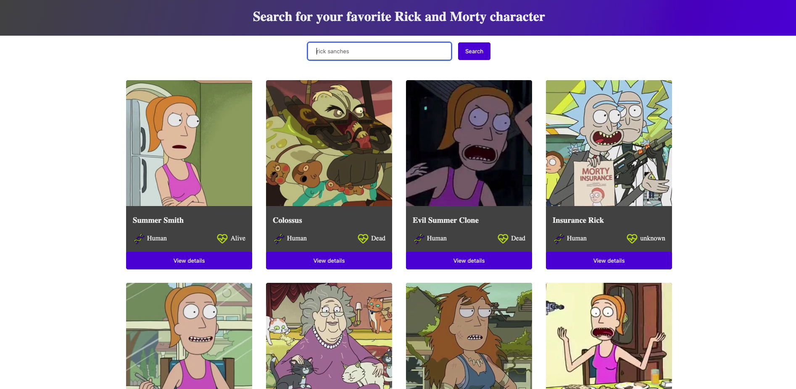

# 🛸 Rick and Morty - Explorador de Personajes

Una aplicación web moderna y rápida construida con HTML, CSS, Vanilla JavaScript y Vite, que consume la API de Rick and Morty para explorar sus personajes.
### 🏗️ Arquitectura

Se optó por utilizar una arquitectura basada en componentes, lo que permite:

* **Mantenibilidad**: Código fácil de leer y corregir.

* **Reutilización**: Componentes independientes que se pueden usar en distintas partes de la app.

* **Separación de responsabilidades**: Lógica de datos (Services) separada de la interfaz de usuario (Componentes).




### 🚀 Características

* **Renderizado Dinámico:** Generación de componentes mediante Template Strings de JS.
* **Gestión de Estado:** Manejo de datos asíncronos desde una API REST.
* **Interfaz Responsiva:** Diseño adaptativo para móviles y escritorio.
* **Sistema de Iconos:** Iconos SVG integrados.
* **Modales Detallados:** Información expandida de cada personaje usando un modal.

### 🛠️ Tecnologías

* [Vite](https://vitejs.dev/) - Herramienta de construcción (Bundler) ultra rápida.
* **Vanilla JavaScript (ES6+)** - Sin frameworks, solo JS puro.
* **CSS3** - Estilos personalizados con variables y animaciones.
* **HTML5** - La estructura base de la web.
* [Rick and Morty API](https://rickandmortyapi.com/) - Fuente de datos.

### 📦 Instalación

Sigue estos pasos para ejecutar el proyecto localmente:

1. **Clona el repositorio:**
```bash
    git clone https://github.com/soydz/taller-html-Duban-Zuluaga.git

```


2. **Entra a la carpeta:**
```bash
cd taller-html-Duban-Zuluaga

```


3. **Instala las dependencias:**
```bash
pnpm install

```


4. **Inicia el servidor de desarrollo:**
```bash
pnpm dev

```


5. **Abre en tu navegador:**
`http://localhost:5173`

### 📂 Estructura del Proyecto

```text
├── src/
│   ├── components/    # Funciones que retornan el HTML (Cards, Modals, Navbar)
│   ├── icons/         # Biblioteca de iconos SVG
│   ├── services/      # Lógica de comunicación con la API (Fetch)
│   ├── constants.js   # Configuración global (API_URL)
│   └── main.js        # Orquestador: une los servicios con los componentes
├── index.html         # Esqueleto base y punto de montaje del DOM
├── package.json       # Manifiesto del proyecto y scripts de Vite
└── README.md          # Guía de uso y documentación técnica
```
